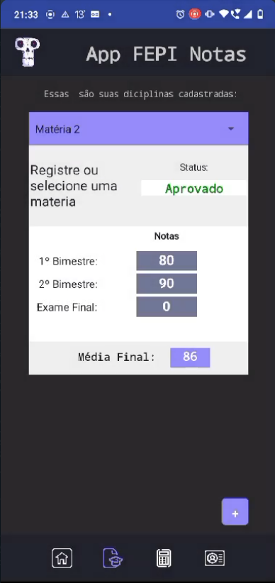

 # App FEPI Notas  

[**Página Projeto**](https://lucagx.github.io/App-FEPI-documentacao/)

_______

[Lucas Gabriel X.](https://github.com/lucagx/)

[Alisson Felipe](https://github.com/AlissonFelCosta)

_______

## Visão Geral

O **"App FEPI Notas"** é um aplicativo projetado para estudantes para ajudar no cálculo de notas semestrais e finais, bem como no acompanhamento do progresso acadêmico. Com base em notas dos bimestres N1 e N2, o aplicativo permite calcular a nota semestral e determinar se o aluno foi aprovado, reprovado ou precisa fazer um exame final.
Essa documentação busca apresentar a modelagem do sistema mostrando como foi o desenvolvimento desde a proposta até a prototipagem.

_______

## Aplicativo Final

Aplicativo desenvolvido integralmente com o MIT App Inventor para fins acadêmicos na disciplina de desenvolvimento de sistemas da faculdade.

|  |  |  |
|:--:| :--:| :--:|
| **1.Tela Login** | **2.Tela de Cadastro** | **3.Tela de Inicial** |
|  |  | |
| **4.Tela Disciplinas** | **5.Tela de Calculo notas** | **6.Tela de Perfil Usuário** |

_______


**Funcionalidades Principais**
- Cálculo da nota semestral com base em N1 e N2.

- Determinação do status do aluno (aprovado, reprovado, ou exame final).

- Cálculo da nota final para alunos que precisam do exame.

- Armazenamento, visualização, alteração e exclusão de disciplinas e notas.

- Interface amigável e fácil de usar.

_______


## Instalação

Para instalar siga estas etapas:

1. Clone este repositório para o seu ambiente local:

```
   git clone https://github.com/lucagx/App-FEPI-documentacao.git
```

2. Navegue para o diretório do projeto:

```
cd App-FEPI-documentacao
```

3. Siga as instruções para instalar dependências:

```
    pip install mkdocs
    pip install mkdocs_dracula_theme
    pip install pymdown-extensions 
```
