# Wireframes e Protótipos

Com base nas necessidades específicas levantadas, e nos requisitos detalhados,  geramos ideias para representar a solução visualmente, buscando descrever todos os elementos presentes da maneira mais simples possível. Este processo visa criar uma interface inicial que demonstre a funcionalidade chave do sistema.

#### Wireframes:
 

| 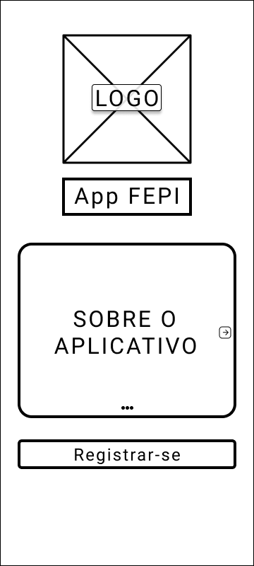 | 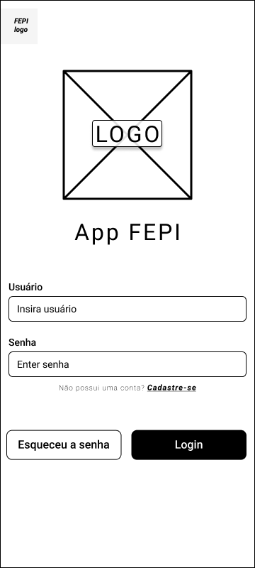 | 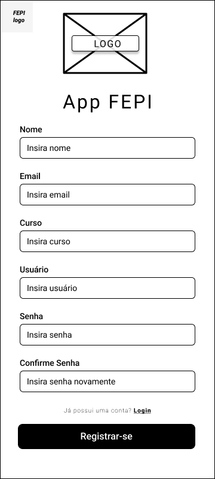 |
|:--:| :--:| :--:|
| **1.Tela Inicial** | **2.Tela de Login** | **3.Tela de Cadastro** |
| 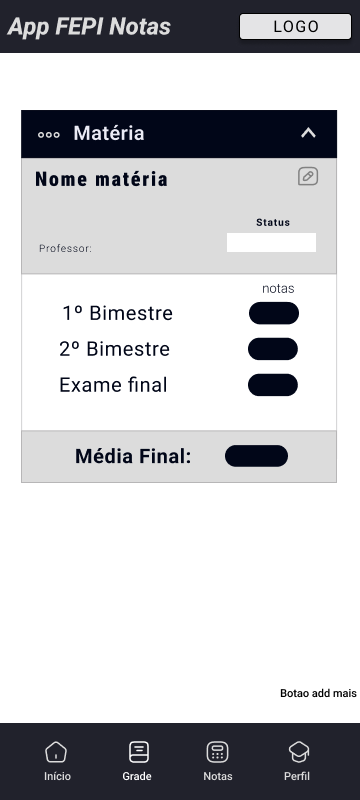 | 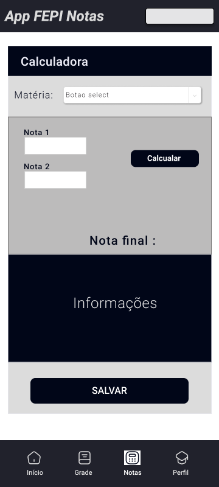 |
| **4.Tela Disciplinas** | **5.Tela de Calculo notas** |

 

#### Protótipos:

 

Os protótipos apresentados a seguir representam as principais telas do sistema, demonstrando a interação do usuário e a lógica de navegação. Eles foram projetados para serem interativos, permitindo aos usuários explorar os diferentes fluxos de trabalho e fornecer feedback sobre a experiência. Com essas representações, esperamos que o sistema possa ser implementado com sucesso, atendendo aos requisitos funcionais definidos.
Apresentamos então uma visão geral da prototipação que foi feita utilizando a ferramenta do **Figma** para sua criação e considerando todos os itens previamente estabelecidos.

 

| 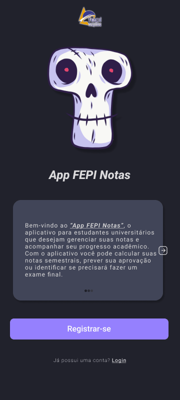 | 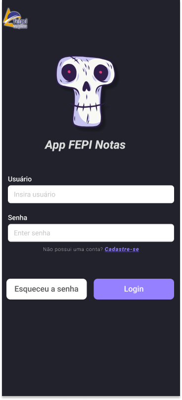 | 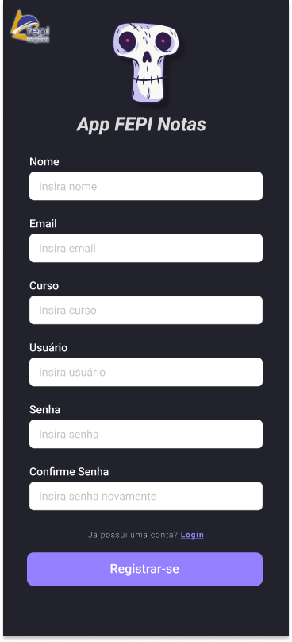 |
|:--:| :--:| :--:|
| **1.Gif Tela Inicial Apresentação** | **2.Tela de Login** | **3.Tela de Cadastro** |
| 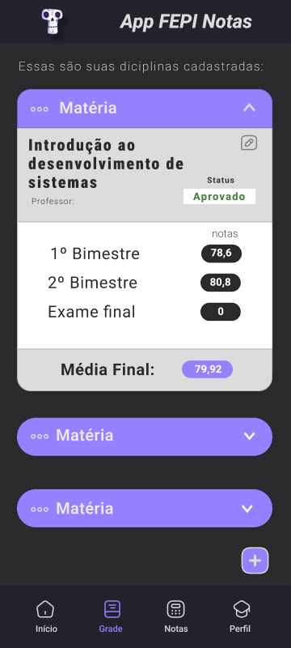 | 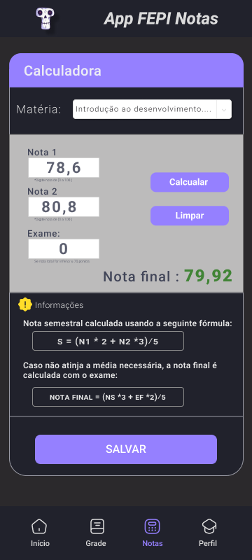 | 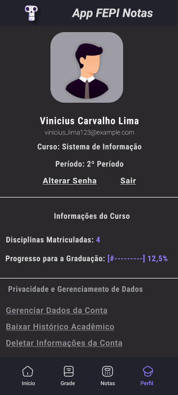 |
| **1.Tela Visualizar Disciplinas** | **2.Tela de Cálculo Notas** | **3.Tela Perfil Aluno** |

 

Os protótipos fornecem uma visão valiosa de como o sistema será em termos de usabilidade e funcionalidade.Convidamos todos a explorar os protótipos e compartilhar suas opiniões para ajudar a construir um sistema mais eficaz e amigável.
Acesso aos Protótipos no [**Figma**]((https://www.figma.com/file/dl6srUu6TUtIOE9bpoot7X/App-fepi-Notas?type=design&node-id=0%3A1&mode=design&t=k4d6MIrqEKBUTerF-1))

<iframe style="border: 1px solid rgba(0, 0, 0, 0.1);" width="800" height="450" src="https://www.figma.com/embed?embed_host=share&url=https%3A%2F%2Fwww.figma.com%2Ffile%2Fdl6srUu6TUtIOE9bpoot7X%2FApp-fepi-Notas%3Ftype%3Ddesign%26node-id%3D0%253A1%26mode%3Ddesign%26t%3Dk4d6MIrqEKBUTerF-1" allowfullscreen></iframe>